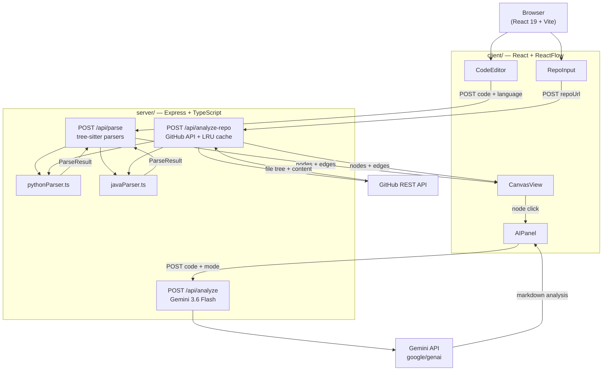

# CodeViz AI

**An interactive AST visualizer with Gemini-powered code analysis and GitHub repo exploration.**

Paste Python or Java code (or point it at a public GitHub repo) and CodeViz AI parses it with a real tree-sitter AST, renders the class/function graph in an interactive ReactFlow canvas, and lets you click any node to get a Gemini AI explanation — either a deep technical breakdown or a plain-English analogy.

---

## Screenshot

> _Screenshot placeholder — deploy the app and add one here._
>
> Key UI areas: left panel (code editor / GitHub URL input) · center (ReactFlow graph with class nodes, function nodes, call/inheritance edges, hover highlights) · right panel (AI Inspector with Technical / Plain English toggle).

---

## Architecture



---

## Setup

### Prerequisites

- Node.js 18+
- A [Gemini API key](https://aistudio.google.com/app/apikey) (free tier works fine)
- _(Optional)_ A GitHub personal access token for higher rate limits on repo analysis

### Server

```bash
cd server
cp .env.example .env          # fill in GEMINI_API_KEY (and optionally GITHUB_TOKEN)
npm install
npm run dev                   # starts on http://localhost:3001
```

### Client

```bash
cd client
# Optional: cp .env.example .env and set VITE_API_URL if the server isn't on :3001
npm install
npm run dev                   # starts on http://localhost:5173
```

Open **http://localhost:5173** in your browser.

---

## Environment Variables

### Server (`server/.env`)

| Variable | Required | Default | Description |
|---|---|---|---|
| `GEMINI_API_KEY` | ✅ | — | Google Gemini API key |
| `GITHUB_TOKEN` | ☑️ | — | GitHub PAT for 5000 req/hr (vs 60 unauthenticated). Required for repos > ~50 files. |
| `PORT` | ☑️ | `3001` | HTTP port |
| `CORS_ORIGINS` | ☑️ | `http://localhost:5173` | Comma-separated list of allowed frontend origins. Set this for deployment. |
| `RATE_LIMIT_WINDOW_MS` | ☑️ | `900000` (15 min) | Rate limit window in milliseconds |
| `RATE_LIMIT_MAX` | ☑️ | `20` | Max requests per window per IP (applies to `/api/analyze` and `/api/analyze-repo`) |
| `GEMINI_MODEL` | ☑️ | `gemini-3.6-flash` | Primary Gemini model. **Do not use `gemini-2.0-flash`** — shut down June 1, 2026 (returns 404). |
| `GEMINI_FALLBACK_MODEL` | ☑️ | `gemini-3.5-flash` | Fallback model used automatically if the primary call fails (quota / outage). |

### Client (`client/.env`)

| Variable | Required | Default | Description |
|---|---|---|---|
| `VITE_API_URL` | ☑️ | `http://localhost:3001/api` | Server API base URL. Set to your deployed server URL (e.g. `https://codeviz-api.onrender.com/api`) |

---

## Supported Languages

| Language | File Extensions | What's Extracted |
|---|---|---|
| Python | `.py` | Classes, functions (`async def`, decorated, nested-safe), inheritance, method membership, call edges, imports |
| Java | `.java` | Classes / interfaces / enums, methods, constructors, `extends` / `implements` edges, call edges, imports |

> **Adding a new language**: install the `tree-sitter-<lang>` binding, implement a parser following the `ParseResult` interface in `server/src/types.ts`, and register it in `server/src/routes/parse.ts` and `analyzeRepo.ts`.

---

## Known Limitations

- **Cross-file call resolution is best-effort**: The repo analysis finds import-matching by module path stem. It does not resolve dynamic dispatch, conditional imports, or monkey-patching.
- **Rate limits**: Without `GITHUB_TOKEN`, repo analysis will exhaust GitHub's anonymous rate limit (60 req/hr) for repos with more than ~50 supported files.
- **Repo size cap**: Analysis is capped at 300 files / 5 MB of source content. Repos above this threshold receive a 413 error with a clear message.
- **Single server deployment**: The LRU cache is in-process. In a multi-instance deployment the cache won't be shared across instances (acceptable for a demo; use Redis for production scale).

---

## Design Tradeoffs

### Why tree-sitter over a full compiler frontend?

A full compiler frontend (e.g. the Python `ast` module via a subprocess, or `javac`'s annotation processing API) would give us a richer semantic model — full name resolution, type inference, correct handling of `__all__`. But it would require: a Python runtime on the server for Python, a JDK for Java, and a separate subprocess per parse request. **tree-sitter** gives us a fast, incremental, language-agnostic C library with Node.js bindings that works identically across all deployment platforms without any language-specific runtimes. The tradeoff is shallow semantics: we see syntax, not fully-resolved names. For the use case (visual graph of code structure, not a compiler) this is the right call.

### Why Gemini over a local model?

Running a local LLM capable of nuanced code analysis (70B+ parameter level) requires hardware most developers and PaaS platforms don't have. Gemini's API is free-tier friendly at the volumes this app generates, and the latency (1–3s per node analysis) is acceptable for an interactive inspector. A future improvement could offer a local Ollama backend as an alternative for users with capable hardware.

### Why regex-based parsers originally, and why tree-sitter now?

The regex parsers were a fast first-pass to prove the concept: "can we extract enough structure to build an interesting graph?" They worked for simple cases but broke on: `async def`, multi-line signatures, decorators, generic type parameters with commas in Java, and nested functions. tree-sitter resolves all of these by working from the actual parse tree rather than text patterns. The rewrite was straightforward because the output contract (`{ nodes, edges }`) was defined up-front and the tests asserted on shape rather than exact values.

### Why single-file analysis shipped before repo-level?

Single-file analysis validated the entire stack (parser → graph → ReactFlow canvas → Gemini AI) in one tight loop. This caught UX and layout issues early, before adding the complexity of multi-file orchestration, GitHub API pagination, LRU caching, and cross-file edge resolution. Shipping the simple version first also meant users could try the app immediately with any code snippet, without needing a public GitHub repo.

---

## Deployment

The app is structured to deploy as two separate services:

| Service | Platform | Notes |
|---|---|---|
| `client/` | Vercel / Netlify | Set `VITE_API_URL` to the server URL |
| `server/` | Render / Railway / Fly.io | Set all env vars from the table above |

> **TODO (manual)**: Set the GitHub repository's **Description** and **Topics** in Settings → General. Suggested topics: `react`, `typescript`, `tree-sitter`, `gemini-ai`, `ast-visualizer`, `reactflow`, `code-visualization`.

---

## Development Scripts

```bash
# Server
cd server
npm run dev          # tsx watch (hot reload)
npm run typecheck    # tsc --noEmit
npm test             # vitest run (36 tests)

# Client
cd client
npm run dev          # vite dev server
npm run build        # vite production build
npm run lint         # oxlint
```

---

## License

MIT — see [LICENSE](./LICENSE).
